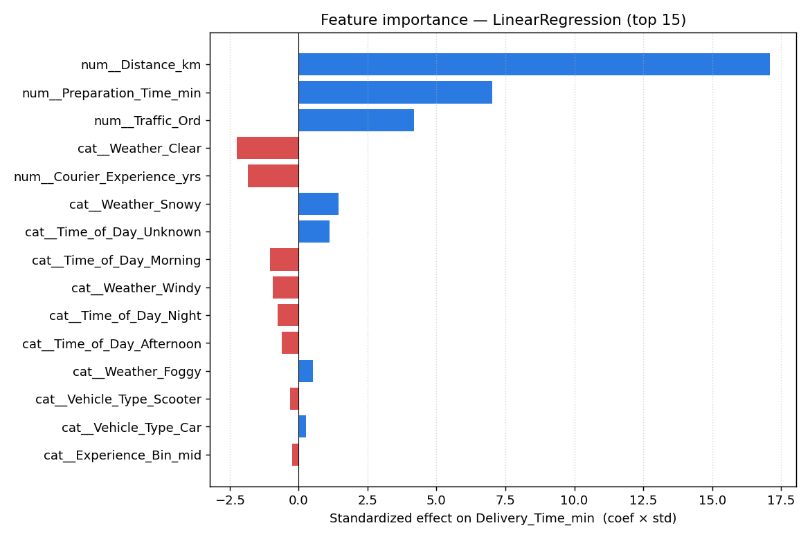
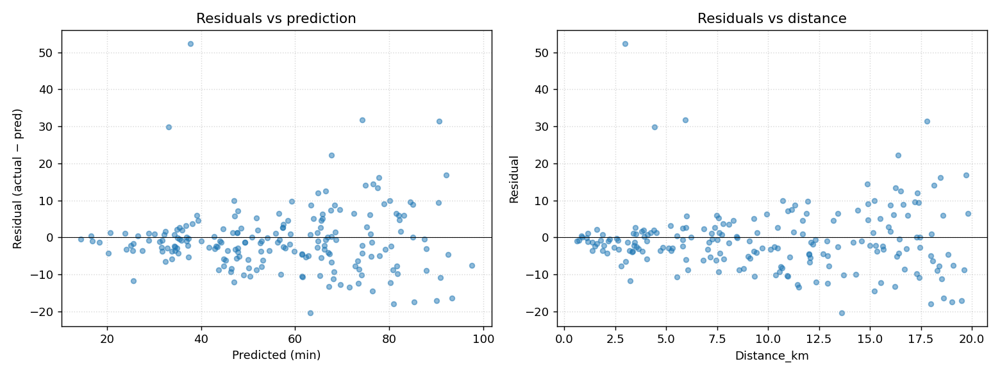

# Explainability

Winning model is LinearRegression, which has a huge advantage for this section: the coefficients *are* the explanation. No SHAP theater needed.

To rank features by actual impact (not just raw coefficient size — that depends on units), I used **standardized effect = coef × feature_std**. It reads as "minutes of delivery time explained per 1-SD move in the feature".

## Top drivers

| # | Feature | Std. effect (min) | Direction |
|---|---|---|---|
| 1 | Distance_km | **+17.1** | farther → slower |
| 2 | Preparation_Time_min | **+7.0** | slower kitchen → slower delivery |
| 3 | Traffic_Ord (Low<Med<High) | **+4.2** | more traffic → slower |
| 4 | Weather = Clear | **−2.2** | clear weather shaves ~2 min |
| 5 | Courier_Experience_yrs | **−1.8** | experience shaves ~2 min per SD |
| 6 | Weather = Snowy | **+1.5** | snow adds ~1.5 min |
| 7 | Time_of_Day = Morning | **−1.0** | mornings a bit faster |

Full table in `outputs/reports/feature_importance.csv`.

## What this says operationally

**Distance dominates everything.** It explains roughly as much variance as all other features combined. This is expected and good — it means a simple "minutes per km + kitchen wait + a traffic multiplier" mental model is basically correct. Nothing exotic is going on.

**Prep time is the second lever, and it's controllable.** Distance is physics; kitchen prep is process. Every minute of prep time shaved is ~1 min of promised delivery shaved. This is the operator's biggest internal lever.

**Traffic is worth ~4 min between low and high.** The ordinal encoding captures a monotonic effect cleanly. The `Distance_x_Traffic` interaction ended up with near-zero coefficient (0.06 min std-effect), which is interesting — once you account for Distance and Traffic separately, their linear interaction doesn't add much *on average*. The residual plot below suggests the true interaction is nonlinear.

**Weather effects are smaller than I expected.** Clear weather is ~2 min faster than baseline; Snowy is ~1.5 min slower. Foggy barely moves the coefficient (+0.5) — but see `error_insights.md`, because bias tells a different story than average effect.

**Courier experience helps, modestly.** ~2 min for an experienced courier vs a new one, other things equal. The experience bucket features didn't add signal once the raw variable was in — suggests the effect is smooth, not step-wise, in this sample.

**Vehicle type barely moves the needle.** Car is ~0.3 min faster than Bike on average. Not a useful lever.

## Residuals

Two things to note:

1. **Residuals vs prediction**: roughly zero-mean but variance grows with predicted time. This is mild heteroscedasticity. Long deliveries are inherently less predictable — makes sense, more things can go wrong on a 15 km run than a 2 km run.

2. **Residuals vs distance**: fan shape. Short trips are tightly predicted (std ~3 min), long trips spread out (std ~10 min). If we wanted a confidence interval on ETAs we'd want to model this explicitly — a quantile regression or a residual-variance model on top.

## Why trees didn't find anything linear missed

With only 1000 rows and a target that's ~80% explained by 3 features, there's no hidden interaction structure for boosting to mine. Tree models ended up splitting on noise at the edges. In a richer dataset (temporal, restaurant-level, courier history) I'd bet on XGBoost surfacing things like "courier X is consistently 3 min slow on Tuesdays" — but we don't have the columns for that here.
